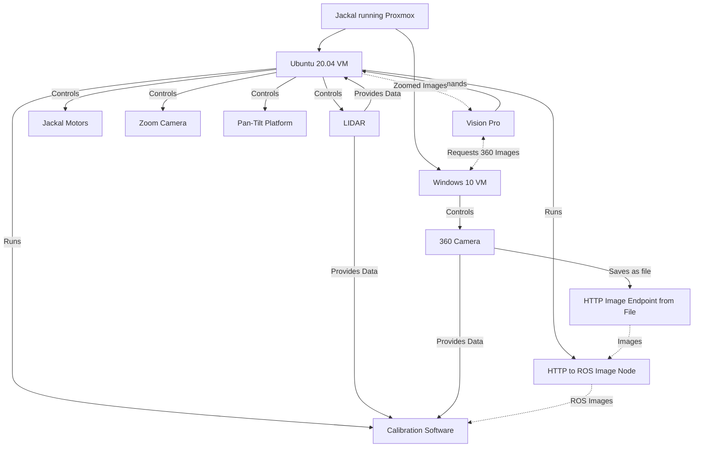

# Monorepo for vision pro UGV control

## Hardware Overview

- Apple Vision Pro
- Clearpath Jackal
- Custom Computer Internals 
- LadyBug 5 360 Camera
- Livox Avia Lidar
- IQR Pan-tilt
- Kurokesu L086 motorized zoom lens
- Kurokesu USB camera C3_4K

man i can buy a whole tesla with this budget 💀

## Architecture

**Note: VMs are graphically accelerated through SR-IOV**

## Getting started

### Vision pro
Build and run via Xcode
### Ladybug 5
Open `vision-pro-ugv-inspector\windows\ladybug\src`
Build and run on windows via VS

